## Preference Leakage: A Contamination Problem in LLM-as-a-judge

This is the official repository of the paper [Preference Leakage: A Contamination Problem in LLM-as-a-judge](https://arxiv.org/abs/2502.01534).

- Find more interesting papers about LLM-as-a-judge in our [website](https://llm-as-a-judge.github.io/)!
- If you find our work helpful and it has been of any assistance to you, we would greatly appreciate it if you could kindly cite it:
```
@article{li2025preference,
      title={Preference Leakage: A Contamination Problem in LLM-as-a-judge}, 
      author={Dawei Li and Renliang Sun and Yue Huang and Ming Zhong and Bohan Jiang and Jiawei Han and Xiangliang Zhang and Wei Wang and Huan Liu},
      year={2025},
      eprint={2502.01534},
      archivePrefix={arXiv},
      primaryClass={cs.LG},
      url={https://arxiv.org/abs/2502.01534}, 
}
```

## 🚀 Introduction

Large Language Models (LLMs) as judges and LLM-based data synthesis have emerged as two fundamental LLM-driven data annotation methods in model development. While their combination significantly enhances the efficiency of model training and evaluation, little attention has been given to the potential contamination brought by this new model development paradigm. In this work, we expose *preference leakage*, a contamination problem in LLM-as-a-judge caused by the relatedness between the synthetic data generators and LLM-based evaluators.

<div style="text-align: center;">
  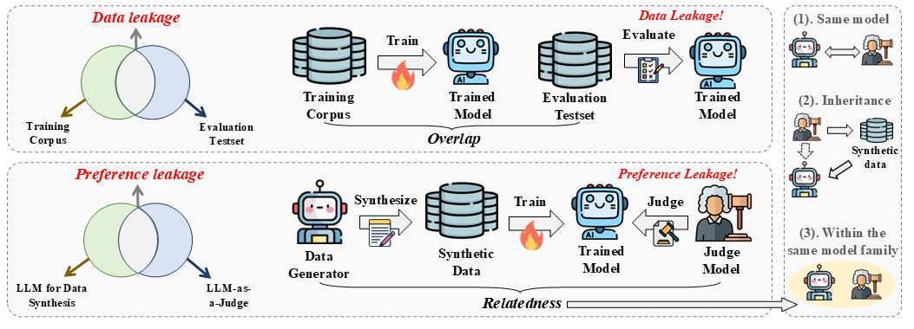
</div>

## 📄 Get Started

### 📝 Setup
- Firstly, install the required environment:
```
conda create -n pl python==3.10

conda activate pl

pip install -r requirements.txt

# important package
deepspeed=0.14.4
flash-attn=2.3.6
llamafactory=0.9.2.dev0
transformers=4.48.1
vllm=0.6.1.post1+cu118
```
- Next, get and fill all the required API. In this work, we use [GPT-4o](https://openai.com/index/gpt-4/), [Gemini-1.5-flash](https://ai.google.dev/gemini-api/docs/models/gemini#gemini-1.5-flash) and [LLaMA-3.3-70B](https://www.together.ai/).
  
### 💻 Models

We use [Mistral-7B-v0.1](https://huggingface.co/mistralai/Mistral-7B-v0.1) for our main experiment. Please first get the access of that model.

### 📥 Data

We put all the dataset used in our experiment [here](https://drive.google.com/drive/folders/1fVQzz0gcRhL6OKc_O4AGHnIq-yd-eckX?usp=sharing), You can directly download it and put `data/` under the current folder, including:
- Instruction seed sampled from [UltraFeedback](https://huggingface.co/datasets/openbmb/UltraFeedback) in `data/UltraFeedback_sampled_30000.json` and `data/UltraFeedback_sampled_30000_new.json`
- Synthetic dataset for each experiment, in `data/sft_data`, `data/pairwise_synthesis`, `data/mixed_data`, `data/inherit_data`, `data_human_written`
- MTBench dataset used to analyze the preference of GPT-4 to LLaMA family in `data/mtbench_extracted.json`
- Model output and judgment results. You can directly download it and put `alpacaEval/`, `alpacaEval_result/` and `arenaHard_result/` under `analysis/` and put `model_answer` under `evaluation/Arena_Hard/data/arena-hard-v0.1/`

## ⛳️ Run

To make the analysis convinient, we released all the judgment results in `analysis/alpacaEval_result/` and `analysis/arenaHard_result/`

### Main Experiment

- First run the following command to train the student models:
```
  bash training/train_sft.sh
```
- Then, judging student models in the two benchmark:
```
  # For Arena-Hard
  cd evaluation/Arena_Hard
  bash inference.sh --sft
  bash judge.sh --sft
  # Then move the judgment result to analysis/Arenahard_result/
  python analysis/parse_arenahard.py --sft

  # For AlpacaEval 2.0
  bash analysis/run_alpacaEval.sh --sft
  # Then copy the output generation to evaluation/Alpaca_Eval2/example/
  cd evaluation/Alpaca_Eval2
  bash judge.sh --sft
  # Then check the output leaderboard.csv for the length-controlled win-rate
```

<div style="text-align: center;">
  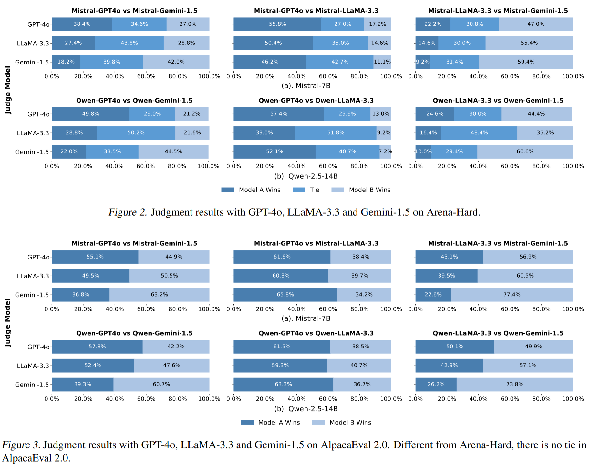
</div>

- To get the preference leakage score, you could follow the equation in our paper to calculate

<div style="text-align: center;">
  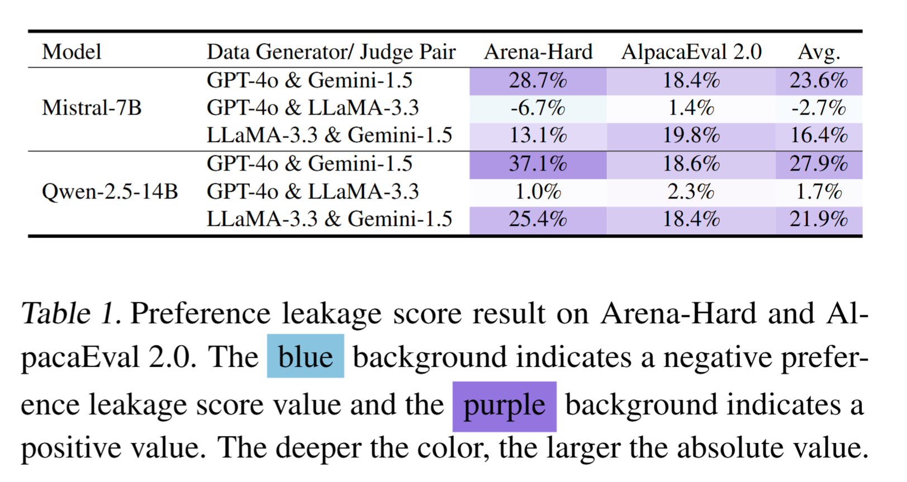
</div>

- To analyze GPT-4's bias to LLaMA family, run:
```
  python llama_analysis.py
```

<div style="text-align: center;">
  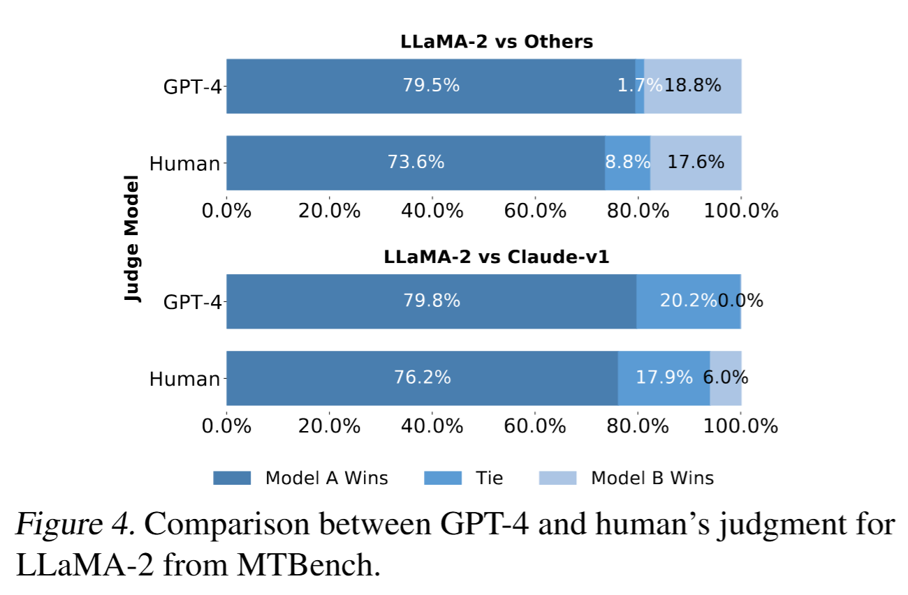
</div>

### Additional Experiment in Various Sizes of LLMs
- First run the following command to train the student models with various sizes:
```
  bash training/train_additional.sh
```
- Then, judging student models in the two benchmark:
```
  # For Arena-Hard
  cd evaluation/Arena_Hard
  bash inference.sh --additional
  bash judge.sh --additional
  # Then move the judgment result to analysis/Arenahard_result/
  python analysis/parse_arenahard.py --additional

  # For AlpacaEval 2.0
  bash analysis/run_alpacaEval.sh --additional
  # Then copy the output generation to evaluation/Alpaca_Eval2/example/
  cd evaluation/Alpaca_Eval2
  bash judge.sh --additional
  # Then check the output leaderboard.csv for the length-controlled win-rate
```

<div style="text-align: center;">
  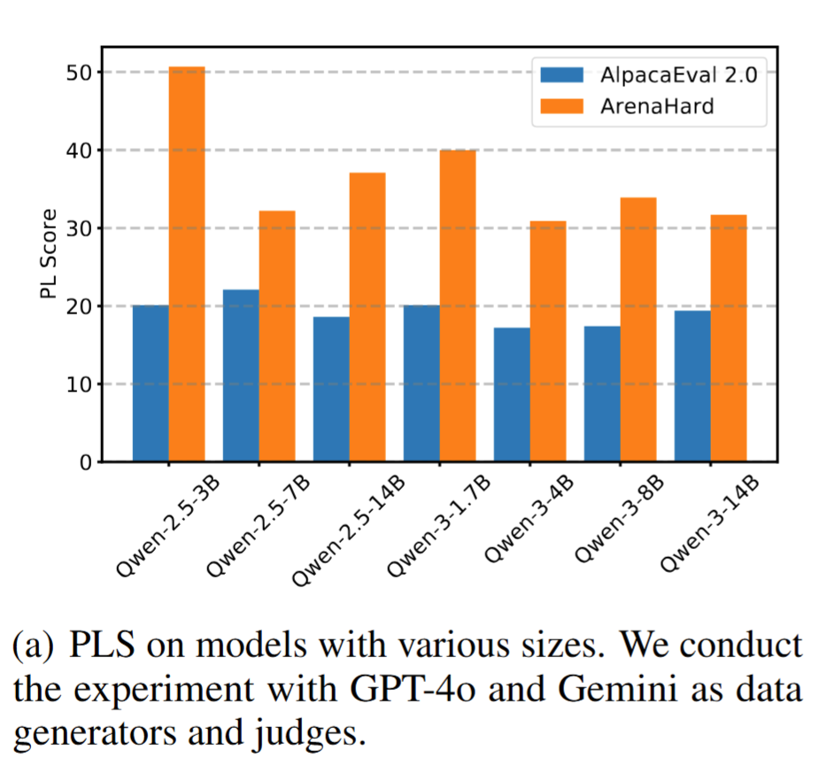
</div>

### Relatedness Analysis

- For inheritance, first train another student model in the synthetic data generated by the sft model, then follow the similar way in main experiment for judgment (using suffix `--inherit`):
```
  bash training/train_inherit.sh
```

- For models in the same family, directly judge the sft model with GPT-4-turbo & Gemini-1.5-pro or GPT-3.5-turbo & Gemini-1.0-pro:
```
  cd evaluation/Arena_Hard
  bash inference.sh --same_family
  bash judge.sh --same_family
  python analysis/parse_arenahard.py --same_family

  cd evaluation/Alpaca_Eval2
  bash judge.sh --same_family
```

<div style="text-align: center;">
  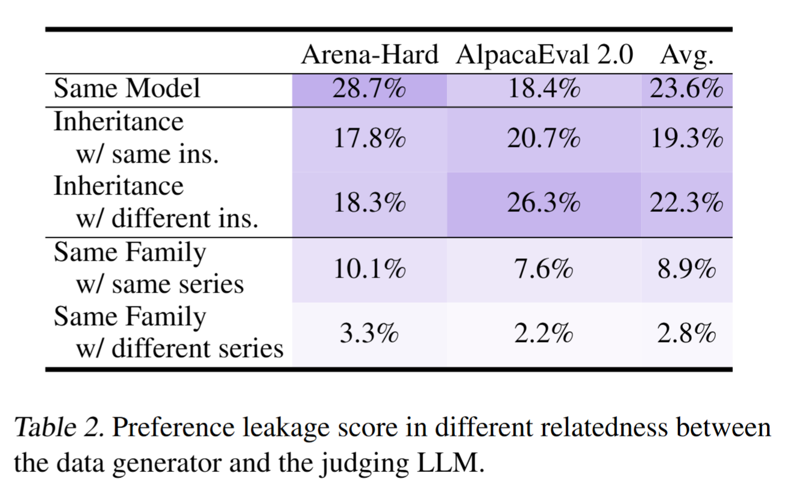
</div>

### Learning Method Analysis
- For DPO, first train a student model in manual-written dataset, then using the synthetic pairwise data to further tune the policy, then follow the similar way in main experiment for judgment (using suffix `--dpo`):
```
  bash training/train_human.sh
  bash training/train_dpo.sh
```

- For ICL, directly use the student model trained in dpo experiment and add demonstration to do inference:
```
  cd evaluation/Arena_Hard
  bash inference.sh --icl
  bash judge.sh --icl
  python analysis/parse_arenahard.py --icl

  bash analysis/run_alpacaEval.sh --icl
  cd evaluation/Alpaca_Eval2
  bash judge.sh --icl
```

<div style="text-align: center;">
  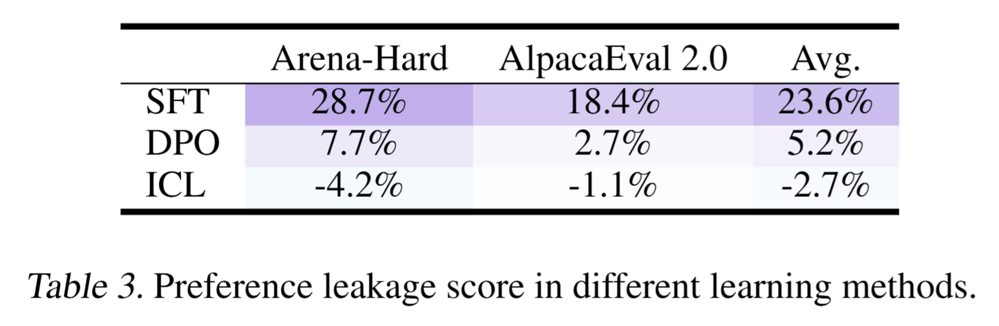
</div>

### Data Mixing Analysis

- To mix with manuall-written data and multisource synthetic data, first train student model with mixing data, then follow the similar way in main experiment for judgment (using suffix `--mix`):
```
  bash training/train_mix.sh
```

<div style="text-align: center;">
  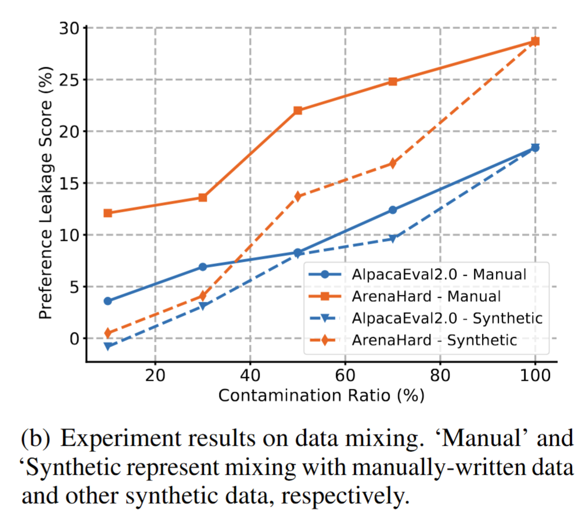
</div>

### Real-world Impact Analysis

- Run the following line to compare preference leakage with egocentri bias in terms of impact in AlpacaEval leaderboard:
```
  python analysis correlation.py
```

<div style="text-align: center;">
  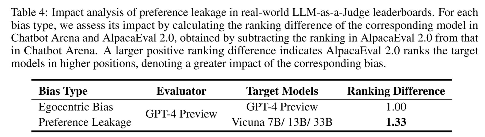
</div>

### Recognition Analysis

- For related student recognition, run:
```
  python analysis/student_recognition.py
  python analysis/student_recognition_pairwise.py
```

- For BERT classification on three students models' responses, run:
```
  python analysis/bert_recognition.py
```

<div style="text-align: center;">
  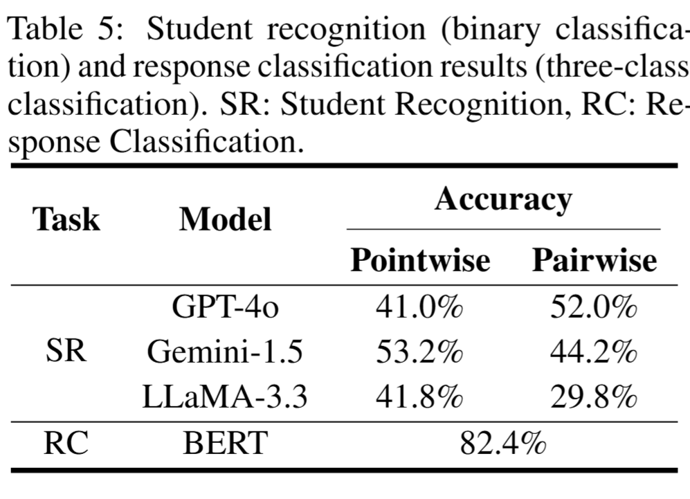
</div>

### Categorization Analysis

- For question type categorization, run:
```
  python analysis/dataset_categorization.py
```

- For judgment dimension categorization, run:
```
  bash run_rationale_categorization.sh
```

<div style="text-align: center;">
  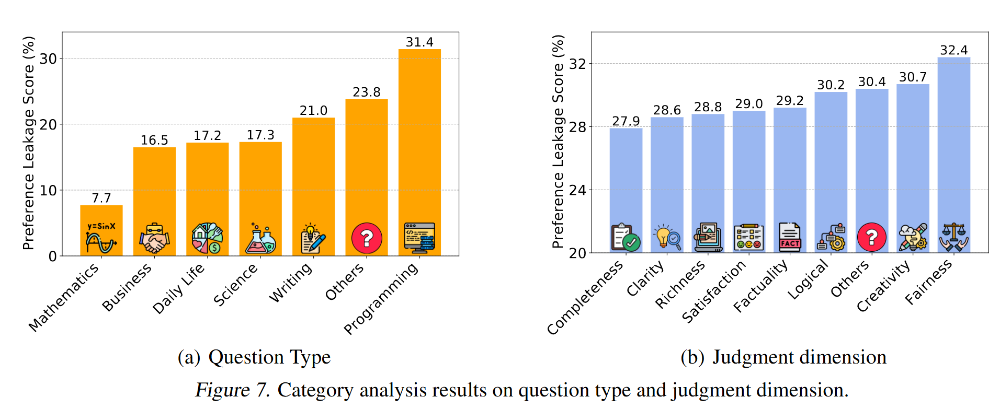
</div>

## Acknowledge

- This work borrows and forks the following repositories for training and evaluation: [LLaMA-Factory](https://github.com/hiyouga/LLaMA-Factory/tree/main), [AlpacaEval](https://github.com/tatsu-lab/alpaca_eval), [Arena-Hard](https://github.com/lmarena/arena-hard-auto).